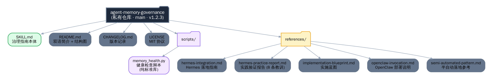
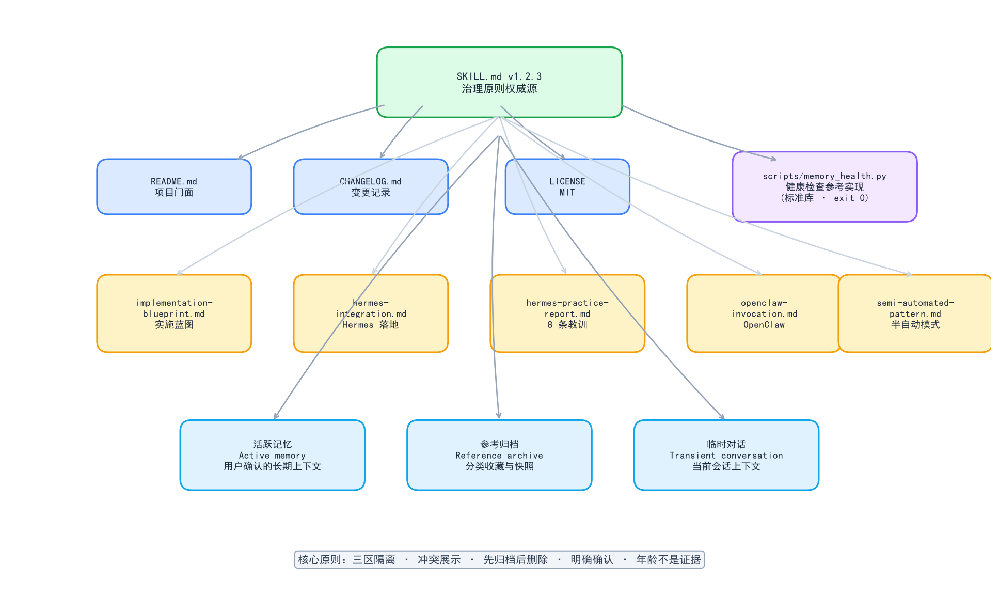

# Agent Memory Governance / Agent 记忆治理

[](https://github.com/weijing143/agent-memory-governance/actions/workflows/ci.yml)
[](LICENSE)
[](CHANGELOG.md)

A governance guide for long-running AI agents: keep active memory separate from reference archives, surface contradictions, and define user-confirmed forgetting boundaries.

长期运行 Agent 的记忆治理指南：活跃记忆与参考归档隔离、冲突必须展示、遗忘边界由用户确认。

## Why / 为什么需要

Agents accumulate memory without discipline — bloat, silent overwrites, contradictory claims. This repository provides **principles, not a fixed workflow**: each agent designs its own implementation from its own tools, storage, and runtime.

Agent 的记忆会无纪律地膨胀——臃肿、静默覆盖、自相矛盾。本仓库提供**原则而非固定流程**：每个 Agent 基于自身工具与存储自行设计实现。

## Quick Start / 快速开始

This is a **Skill / 技能**，not a library. Although it provides principles rather than fixed code, `SKILL.md` follows the standard Skill format and can be loaded directly by Hermes Agent and OpenClaw.

虽然本项目提供的是原则而非固定代码，但 `SKILL.md` 采用标准 Skill 格式封装，可直接被 Hermes / OpenClaw 加载使用。Pick your platform:

- **Hermes Agent** — copy `SKILL.md` into your skills directory and read `references/hermes-integration.md` for storage mapping and cadence.
- **OpenClaw** — deploy as a user-invocable skill (`$agent-memory-governance`); see `references/openclaw-invocation.md` for frontmatter, path mapping, and cron setup.

To run the reference health check:

```bash
# Default Hermes conventions
python scripts/memory_health.py

# Custom runtime (example)
python scripts/memory_health.py \
  --mem-dir ./memories \
  --files "MEMORY.md:memory_char_limit,USER.md:user_char_limit" \
  --limits "memory_char_limit=8000,user_char_limit=4000" \
  --delimiter "\\n# " \
  --no-config
```

## Core Principles / 核心原则

1. **Three-zone isolation** — active memory / reference archive / transient conversation stay separate. 三区隔离：活跃记忆 / 参考归档 / 临时对话。
2. **Surface contradictions** — show conflicting claims, sources, time clues; the user decides. 冲突必须展示，用户裁决。
3. **Archive requires confirmation** — reading a link is not consent. 归档必须明确确认，阅读≠同意。
4. **Archive before delete** — deletion needs explicit confirmation and a permitted executor. 归档先于删除，删除需确认。
5. **Age is not evidence** — old content can still matter. 仅凭时间不能证明内容不重要。

## What This Is Not / 这不是什么

- **Not an automatic cleaner.** This Skill only guides reasoning; it does not move, rewrite, archive, or delete data by itself.
- **Not a platform memory eraser.** It does not erase provider-side memory, chat history, or hidden application state.
- **Not a fixed schema or command set.** Agents must design their own workflow from their own tools and runtime.

## Repository Layout / 目录结构

```
├── SKILL.md                        # The governance guide itself / 治理指南本体
├── README.md                       # Project overview + diagrams / 项目简介与结构图
├── CHANGELOG.md                    # Version history / 版本记录
├── LICENSE                         # MIT license / MIT 协议
├── scripts/
│   └── memory_health.py            # Health-check script (stdlib, reference impl) / 健康检查脚本
├── references/
│   ├── implementation-blueprint.md # Implementation templates / 实施模板
│   ├── openclaw-invocation.md      # OpenClaw deployment notes / OpenClaw 部署说明
│   ├── hermes-integration.md       # Hermes Agent integration guide / Hermes 落地指南
│   ├── hermes-practice-report.md   # Measured results & lessons (2026-08-24) / 实践验证报告
│   └── semi-automated-pattern.md   # Semi-automated deployment reference / 半自动落地参考
├── tools/
│   └── generate_diagrams.py        # Regenerate tree.png / map.png (matplotlib) / 图表生成工具
├── tests/
│   └── test_memory_health.py       # Unit tests for memory_health.py / 单元测试
├── .github/
│   └── workflows/
│       └── ci.yml                  # GitHub Actions CI / 持续集成
└── assets/
    └── diagrams/
        ├── tree.png                # Repository tree diagram / 目录树状图
        └── map.png                 # Repository structure map / 结构关系图
```

### Structure Diagrams / 结构图





Diagrams are generated by [`tools/generate_diagrams.py`](tools/generate_diagrams.py) using matplotlib. To regenerate:

```bash
python tools/generate_diagrams.py
```

## Development / 开发

Run tests locally:

```bash
python -m unittest discover -s tests -v
```

CI runs on every push/PR via `.github/workflows/ci.yml`.

See [`CONTRIBUTING.md`](CONTRIBUTING.md) for how to contribute.

## Platform Support / 平台适配

| Platform | How it fits / 接入方式 | Verified / 验证状态 |
|---|---|---|
| **OpenClaw** | User-invocable only, model-invocation disabled (`$agent-memory-governance`) — see `openclaw-invocation.md` | ✅ 已验证 2026-08-24（OpenClaw 实测部署） |
| **Hermes Agent** | Companion `memory-governance` skill + health scripts + cron cadence — see `hermes-integration.md` | ✅ 已验证 2026-08-24（见 practice report） |

## Verified in Practice / 实践验证

Landing on Hermes Agent (2026-08-24): memory capacity **99% → 79%**, retrieval across taxonomy zones verified, deleted entries recoverable from session history. Full details and eight hard-won lessons in [`references/hermes-practice-report.md`](references/hermes-practice-report.md).

已在 Hermes Agent 实际落地验证（2026-08-24）：记忆占用 **99% → 79%**，跨分类区检索验证通过，已删条目可从会话历史找回。完整细节与八条经验教训见[实践报告](references/hermes-practice-report.md)。
